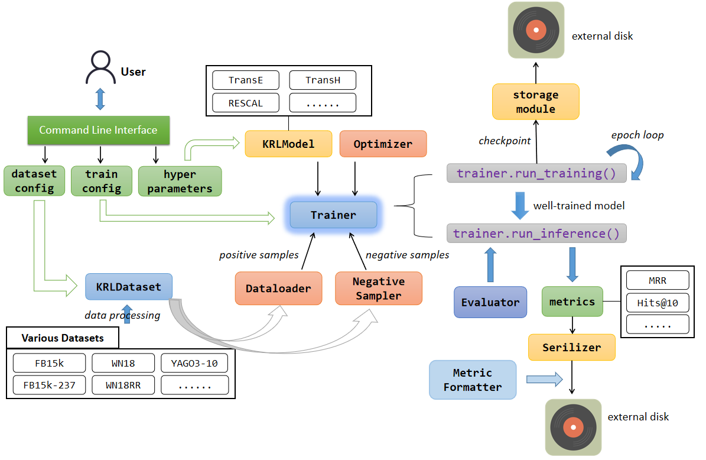

# KRL

This is a framework that uses PyTorch to reproduce Knowledge Representation Learning (KRL) models. With it, you can easily run models of knowledge representation learning, while quickly implementing your ideas after making simple changes or extensions.

Currently, we have implemented several knowledge representation learning models including **TransE**, **RESCAL**, and simple abstraction and decoupling of publicly reusable code.

Don't use this repo because I am developing it. So it must suffer broken changes in the future.

The overview structure of this library is below:

<h3 align="center">
    
</h3>


## How to use it?

If you just want to use the models directly, then **you just need to run the sample scripts located in the directory** `./examples` and all you need to do is change a few parameters that you want to change. The call to the training code has been wrapped through [Typer](https://typer.tiangolo.com/), which is a great tool for building CLIs. So we can call the training code by CLIs. The examples can be found in the directory `./examples`.

Example:

```shell
cd ./examples
sh transe.sh
```

If you are trying to make some changes or innovations, then you may need to briefly understand the logic of how this library works. Fortunately, the code is cleanly wrapped and decoupled, which makes it easy for you to understand the logic of the entire program and make changes to parts of it.

First, run through the `transe.ipynb` notebook in the project root directory and you will get to know the core logic of the library. Therefore, successfully running through this notebook is the first step to using the project.
This notebook replicates the operation of the **TransE** model.

In this real program library, there is still a difference between the running logic of a model and the logic in a notebook. To realize the reuse of module code, the program library again abstracts and encapsulates part of the program code, but this does not change the core idea of the model operation.


+ Notice: Before you run this script, you should download the dataset, such as FB15k, and modify the script for choosing the path of the dataset and checkpoints.

The example `./transe.ipynb` is a good tutorial for reproducing the TransE if you want to know the structure of this repo. This tutorial can be run without any dependencies, except for the use of common third-party libraries like PyTorch and Numpy.

## Plan

| Status |  Model   | Year | Paper  | Rewarks |
|  :----:  | :----:  | :----: | :--- | --- |
| :heavy_check_mark:  | [RESCAL](/krl/models/RESCAL.py) | 2011 | ICML'11, [OpenReview](https://openreview.net/forum?id=H14QEiZ_WS) | |
| :heavy_check_mark:  | [TransE](/krl/models/TransE.py) | 2013 | NIPS'13, [ACM](http://dl.acm.org/doi/10.5555/2999792.2999923) | |
| :heavy_check_mark:  | [TransH](/krl/models/TransH.py) | 2014 | AAAI'14, [ReasearchGate](https://www.researchgate.net/publication/319207032_Knowledge_Graph_Embedding_by_Translating_on_Hyperplanes) | |
| :heavy_check_mark: | [DistMult](/krl/models/DistMult.py) | 2014 | ICLR'15, [arXiv](http://arxiv.org/abs/1412.6575) | |
| :heavy_check_mark: | [TransR](/krl/models/TransR.py) | 2015 | AAAI'15, [AAAI](https://ojs.aaai.org/index.php/AAAI/article/view/9491) | a low performance, but I don't know why. |
| :white_circle: | TransD | 2015 | ACL-IJCNLP 2015, [Aclanthology](https://aclanthology.org/P15-1067) | |
| :white_circle: | TransA | 2015 | [arXiv](https://arxiv.org/abs/1509.05490) |  |
| :white_circle: | TransG | 2015 | [arXiv](https://arxiv.org/abs/1509.05488) |  |
| :white_circle: | KG2E | 2015 | CIKM'15, [ACM](https://dl.acm.org/doi/10.1145/2806416.2806502) |  |
| :white_circle: | TranSparse | 2016 | AAAI'16, [AAAI](https://www.aaai.org/ocs/index.php/AAAI/AAAI16/paper/view/11982) | |
| :white_circle: | TransF | 2016 | AAAI'16, [AAAI](https://www.aaai.org/ocs/index.php/KR/KR16/paper/view/12887) | |
| :white_circle: | ComplEx | 2016 | ICML'16, [arXiv](http://arxiv.org/abs/1606.06357) | |
| :white_circle: | HolE | 2016 | AAAI'16, [arXiv](http://arxiv.org/abs/1510.04935) | |
| :white_circle: | R-GCN | 2017 | ESWC'18, [arXiv](http://arxiv.org/abs/1703.06103) | |
| :white_circle: | ConvKB | 2018 | NAACL-HLT 2018, [arXiv](http://arxiv.org/abs/1712.02121) | |
| :white_circle: | ConvE | 2018 | AAAI'18, [arXiv](http://arxiv.org/abs/1707.01476) | |
| :white_circle: | SimplE | 2018 | NIPS'18, [arXiv](http://arxiv.org/abs/1802.04868) | |
| :white_circle: | RotatE | 2019 | ICLR'19, [arXiv](http://arxiv.org/abs/1902.10197) | |
| :white_circle: | QuatE | 2019 | NeurIPS'19, [arXiv](http://arxiv.org/abs/1904.10281) | |
| :white_circle: | ConvR | 2019 | NAACL-HLT 2019, [Aclanthology](https://aclanthology.org/N19-1103) | |
| :white_circle: | KG-BERT | 2019 | [arXiv](http://arxiv.org/abs/1909.03193) | |
| :white_circle: | PairRE | 2021 | ACL-IJCNLP 2021, [Aclanthology](https://aclanthology.org/2021.acl-long.336) | |


## How to contribute it?

If you have read the code of this project, then you should have understood the code style of this library. All you need to do is to extend it as you see fit and submit pull requests after successful testing.
